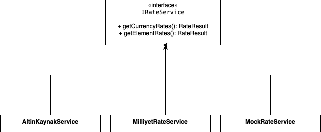

# Spring Boot and JSF Integration Example
In this mini-project an integration between Spring Boot and JSF (PrimeFaces specifically) is demonstrated.

The main purpose of the project is to retrieve rates from online sources and show it in a JSF page. 

## Design
There are three rate sources in the project.

- A mock source
- A source by extracting data from HTTP (https://uzmanpara.milliyet.com.tr/)
- A Web Service source (http://www.altinkaynak.com/Araclar/Servisler)

For each source a dedicated Spring Service is designed. All the services implements the same interface, therefore to use multiple sources at the same time @Qualifier annotation must be used.



RateBean is a view scoped JSF Bean. At first relevant data is gathered from the source services. As long as the user did not click the refresh button, the existing rate data is sent to the user interface. When the user clickc to the refresh button, the data is refreshed from the source services.

## Installation
Installation requires Apache Maven. To be able to install and run the project, the following Maven command must be executed (MacOS and Linux operating systems): 

```bash
./mvnw spring-boot:run
```

On windows the following one should be used (I did not verified):

```bash
mvnw.cmd spring-boot:run
```

The second option is to install by using Docker. First a WAR package must be created by using Maven. Then this package can be moved to a docker container with Tomcat. 

Create WAR package:

```bash
./mvnw clean package
```
Create Docker container and copy the WAR package to the Apache Tomcat in the container.

```bash
docker-compose up --build
```

In the console if the following commands are seen then the installation steps are completed successfully:

```bash
. . .
app_1  | 25-Oct-2020 14:02:45.748 INFO [main] org.apache.catalina.startup.HostConfig.deployWAR Deployment of web application archive [/usr/local/tomcat/webapps/ROOT.war] has finished in [9,567] ms
app_1  | 25-Oct-2020 14:02:45.762 INFO [main] org.apache.coyote.AbstractProtocol.start Starting ProtocolHandler ["http-nio-8080"]
app_1  | 25-Oct-2020 14:02:45.786 INFO [main] org.apache.catalina.startup.Catalina.start Server startup in [9727] milliseconds
```

To see the exchange rates, the following URL address should be followed in any browser: 

```bash
localhost:8080/rate.xhtml
```

## Things to Improve
I had two days to implement this project, therefore I had to skip some parts to complete it. The following items are taken as as note to improve in the future:

- [ ] Unification of the rate sources by using appropriate models. There are a couple of rate sources and each source has different model. These models must be abstracted by using a common model (though it is done a little in the back end, the front end requires a extra effort)
- [ ] Improved exception handling
- [ ] Internationalization
- [ ] Improved user interface (using icons etc.)
- [ ] Improved logging
- [ ] Improved configuration (for example username/password is hardcoded in web service classes)
- [ ] Unit and Integration tests
